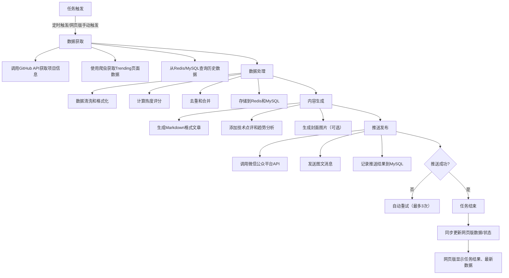

# 个人公众号"GitHub热点"自动化系统项目规划报告（含Docker部署优化）

# 一、项目概述与目标

## 1.1 项目背景与需求分析

在当今软件开发领域，GitHub已成为全球最大的开源社区，每天都有数以万计的新项目发布和现有项目更新。开发者们面临着信息过载的挑战，如何快速发现和了解有价值的技术趋势成为关键需求。同时，随着微信生态系统的不断完善，公众号已成为知识传播和技术分享的重要平台。

基于上述背景，本项目旨在构建一个个人公众号"GitHub热点"自动化系统，通过技术手段实现GitHub热点内容的自动爬取、整理和推送，同步完善网页版（管理平台）功能，实现数据可视化、手动操作、系统配置全流程适配。项目的核心需求包括：

### 功能需求：

- 每天8点自动爬取过去24小时GitHub最热内容

- 每周周一自动生成过去7天最热文章

- 每月1号自动生成过去1月最热文章

- 爬取的数据需要存储到数据库中，支持数据持久化与回溯

- 自动推送到微信公众平台，支持定时推送与手动触发推送

- 建立网页版管理平台，实现数据管理、统计分析、推送控制、系统配置等功能，支持多设备适配

- 支持手动触发推送指定时间段的热点内容，提升运营灵活性

- 采用Docker容器化部署，实现环境一致性、一键启停、快速迁移，网页版与其他模块协同部署

- 网页版支持数据检索、导出，以及推送记录查询、异常排查，适配海外用户访问需求

### 技术需求：

- 选择合适的GitHub数据获取方式（API与爬虫结合）

- 设计高效的自动化调度系统，确保定时任务稳定执行，与网页版操作联动

- 实现稳定的微信推送集成，适配海外账号规范，网页版可实时查看推送状态

- 构建用户友好的网页版管理平台，支持权限管理、数据可视化、响应式设计，适配电脑、手机端访问

- 采用Docker+Docker Compose部署，实现网页版与爬虫、数据库、缓存等模块的隔离与协同，确保部署便捷

- 确保系统的可靠性、可扩展性与可维护性，网页版支持日志查看、系统监控，降低运维成本

## 1.2 项目范围与预期成果

本项目的实施范围包括技术架构设计、系统开发、Docker部署配置、测试、上线和运维等全生命周期活动，重点完善网页版（管理平台）的开发与部署，确保其与整体系统无缝衔接。项目将采用敏捷开发模式，分阶段推进，确保每个阶段都有明确的交付成果，重点突出Docker部署的实用性和便捷性，以及网页版的易用性和功能性。

### 预期成果：

1. 技术架构设计文档：包含系统整体架构、技术选型、数据库设计、Docker部署架构、网页版架构等

2. 自动化爬虫系统：能够按设定频率自动获取GitHub热点数据，支持异常重试与数据去重

3. 微信推送系统：支持定时推送、手动推送功能，适配海外账号限制，网页版可实时控制与监控

4. 网页版管理平台：提供数据查询、检索、导出，统计分析、推送管理、权限控制、系统配置、日志查看等功能，支持响应式设计

5. Docker部署方案：包含Dockerfile、docker-compose.yml配置（含网页版容器配置）、容器化运维指南（启动、更新、备份、迁移）

6. 项目价值评估报告：分析项目的可行性、投资回报率、Docker部署的核心价值、网页版的运营价值等

## 1.3 项目成功标准

项目成功的标准将从技术、功能、性能、运维便捷性和商业价值五个维度进行评估，新增网页版相关成功标准：

### 技术标准：

- 系统架构设计合理，技术选型恰当，Docker部署架构稳定可靠，网页版与其他模块通信顺畅

- 代码质量符合行业标准，具备良好的可维护性，容器化配置可复用，网页版代码可扩展

- 系统运行稳定，故障率低，容器崩溃可自动重启，任务执行成功率≥99%，网页版无卡顿、无异常报错

### 功能标准：

- 实现所有预定的功能需求，自动化任务精准触发，推送功能正常

- 网页版管理平台界面友好，操作便捷，数据统计准确，支持多设备适配，检索、导出功能正常

- Docker部署支持一键启动、一键更新、快速迁移，运维成本低，网页版容器可独立更新、重启

- 网页版权限管理清晰，日志查看便捷，可实现手动推送、异常排查、系统配置等全操作

### 性能标准：

- 日更文章生成时间不超过10分钟，周更、月更文章生成时间不超过30分钟

- 微信推送成功率达到99%以上，管理平台（网页版）响应时间不超过3秒，数据加载流畅

- 容器占用服务器资源合理，2核4G服务器可稳定运行所有容器（含网页版容器），CPU占用率≤60%，内存占用≤70%

- 网页版支持同时在线≥5人，无卡顿、无响应延迟，数据导出速度≤10秒/次

### 运维便捷性标准：

- Docker部署流程简洁，新服务器迁移部署时间≤10分钟，网页版容器可单独部署、更新

- 容器日志统一收集，问题排查便捷，定时任务异常可快速定位，网页版支持日志筛选、下载

- 支持容器化备份与恢复，数据安全可控，无数据丢失风险，网页版配置可导出、导入

### 商业价值标准：

- 项目开发与运维成本控制在预算范围内，Docker部署降低长期运维成本，网页版提升运营效率

- 预计6个月内实现盈亏平衡

- 年投资回报率(ROI)达到150%以上

# 二、技术架构设计（含Docker部署优化）

## 2.1 整体架构设计（Docker容器化架构）

本项目采用"微服务容器化"架构，基于Docker+Docker Compose实现所有模块的隔离部署、统一管理，确保环境一致性、部署便捷性和扩展性，重点优化网页版（web-admin）容器的配置，实现与其他模块的协同联动。整体架构分为5个核心容器，各容器独立运行、按需通信，具体架构如下：

```yaml
# 核心容器架构（docker-compose.yml核心结构，完善网页版容器配置）
version: '3.8'
services:
  # 1. 爬虫与定时任务容器（核心业务）
  crawler-scheduler:
    build: ./crawler
    restart: always  # 崩溃自动重启，保障定时任务稳定
    depends_on:
      - mysql
      - redis
    environment:
      - MYSQL_HOST=mysql
      - REDIS_HOST=redis
    volumes:
      - ./logs/crawler:/app/logs  # 日志挂载，持久化存储
      - ./data/crawler:/app/data  # 临时数据挂载

  # 2. 网页版管理平台Web容器（重点更新，完善配置）
  web-admin:
    build: ./web
    restart: always
    depends_on:
      - mysql
      - redis
    ports:
      - "8000:8000"  # 暴露Web端口，可通过服务器IP访问，支持海外访问配置
    environment:
      - MYSQL_HOST=mysql
      - REDIS_HOST=redis
      - WEB_DEBUG=False  # 生产环境关闭调试模式
      - ALLOWED_HOSTS=*  # 允许所有IP访问，适配海外访问
    volumes:
      - ./logs/web:/app/logs  # 网页版日志挂载
      - ./web/static:/app/static  # 静态文件挂载，便于更新网页样式
      - ./web/media:/app/media  # 媒体文件挂载，存储上传的封面图等
    healthcheck:  # 新增健康检查，确保网页版服务正常
      test: ["CMD", "curl", "-f", "http://localhost:8000/health/"]
      interval: 30s
      timeout: 10s
      retries: 3

  # 3. 数据库容器（MySQL）
  mysql:
    image: mysql:8.0  # 官方镜像，稳定可靠
    restart: always
    ports:
      - "3306:3306"
    environment:
      - MYSQL_ROOT_PASSWORD=xxx
      - MYSQL_DATABASE=github_hotspot
    volumes:
      - ./data/mysql:/var/lib/mysql  # 数据卷挂载，容器删除不丢失数据
      - ./sql/init.sql:/docker-entrypoint-initdb.d/init.sql  # 初始化脚本
    healthcheck:
      test: ["CMD", "mysqladmin", "ping", "-h", "localhost"]
      interval: 30s
      timeout: 10s
      retries: 3

  # 4. 缓存与任务队列容器（Redis）
  redis:
    image: redis:7.0
    restart: always
    ports:
      - "6379:6379"
    volumes:
      - ./data/redis:/data  # 数据持久化
    healthcheck:
      test: ["CMD", "redis-cli", "ping"]
      interval: 30s
      timeout: 10s
      retries: 3

  # 5. 反向代理容器（Nginx，优化网页版访问体验）
  nginx:
    image: nginx:alpine
    restart: always
    ports:
      - "80:80"
      - "443:443"  # 新增HTTPS端口，提升网页版访问安全性，适配海外访问
    depends_on:
      - web-admin
    volumes:
      - ./nginx/conf:/etc/nginx/conf.d
      - ./nginx/ssl:/etc/nginx/ssl  # SSL证书挂载，实现HTTPS访问
      - ./logs/nginx:/var/log/nginx
      - ./web/static:/var/www/static  # 静态文件反向代理，提升网页加载速度
      - ./web/media:/var/www/media
```

各容器职责清晰、耦合度低，通过Docker Compose实现统一调度，支持一键启动、一键更新、快速迁移，彻底解决传统部署中环境冲突、运维复杂的问题。其中网页版容器（web-admin）新增健康检查、静态文件挂载、HTTPS适配等配置，确保网页版访问稳定、安全，适配海外用户访问需求。

## 2.2 数据获取层设计

### 2.2.1 GitHub API vs 网页爬虫技术选型

在获取GitHub数据方面，主要有两种技术路线：使用GitHub官方API和通过网页爬虫获取数据。根据GitHub的技术规范，结合项目需求，采用"混合策略"，兼顾数据稳定性和完整性，同时确保网页版能够实时获取、展示最新数据：

#### GitHub API优势：

- 数据结构化程度高，直接返回JSON格式，解析便捷，便于网页版快速渲染数据

- 官方支持，稳定性好，更新及时，不易触发反爬，保障网页版数据来源稳定

- 提供丰富的接口，涵盖项目信息、作者信息、star/fork数据等，满足网页版多维度展示需求

- 有明确的文档说明和版本控制，便于维护，降低网页版数据更新的维护成本

#### GitHub API劣势：

- 存在严格的速率限制（未认证用户60次/小时，认证用户5000次/小时），需通过Redis缓存优化，避免影响网页版数据加载

- 某些功能（如GitHub Trending页面的实时排名）没有官方API支持，需通过爬虫补充，确保网页版展示完整数据

- 需要申请认证token，增加了配置复杂度，网页版需支持token配置、有效期监控功能

#### 网页爬虫优势：

- 可以获取API无法提供的数据（如GitHub Trending实时排名、项目简介等），确保网页版数据全面

- 灵活性高，可以根据需求自由选择数据字段，适配网页版个性化展示需求

- 没有API调用次数限制，可批量获取数据，支撑网页版历史数据查询、导出功能

#### 网页爬虫劣势：

- 容易触发反爬虫机制，需要处理IP封禁、请求频率限制等问题，避免影响网页版数据更新

- 数据解析复杂，需要处理页面结构变化，维护成本较高，网页版需支持数据解析异常提醒功能

- 稳定性不如API，容易因GitHub页面更新而失效，需建立异常监控，确保网页版数据正常展示

#### 最终方案：混合策略（适配网页版需求）

- 优先使用GitHub官方API获取结构化数据（项目基本信息、star/fork数据等），减少爬虫压力，确保网页版数据加载速度

- 对于API无法覆盖的部分（如GitHub Trending实时排名、热门标签），使用爬虫技术补充，确保网页版数据全面

- 建立API和爬虫的降级机制：API调用失败时，自动切换到爬虫模式，确保数据获取的可靠性，网页版同步显示数据获取状态

- 将爬虫与API请求逻辑封装在同一容器（crawler-scheduler）中，统一管理，数据同步至MySQL和Redis，网页版从Redis获取缓存数据、从MySQL获取历史数据，提升加载效率

### 2.2.2 爬虫框架选型与实现方案

本系统采用Scrapy框架作为主要爬虫工具，基于Python开发，封装在Docker容器中，确保环境一致性和可移植性。Scrapy是Python生态中最成熟的爬虫框架，基于Twisted异步网络引擎，内置"请求调度、数据解析、数据存储、反爬处理"等全套功能，适配项目需求，同时确保爬取的数据能够快速同步至网页版。

#### Scrapy框架优势：

- 基于Twisted异步框架，在2核4G服务器上可实现每秒300+请求，CPU占用率维持在45%以下，性能高效，确保数据快速爬取，支撑网页版实时更新

- 内置调度器、中间件、数据管道等组件，支持异步处理，可批量获取数据，满足网页版历史数据查询需求

- 提供完善的爬虫流程，支持异步抓取、数据清洗、数据存储等功能，开发效率高，便于与网页版数据联动

- 支持分布式爬取，可通过Scrapy-Redis实现多节点协作，便于后期扩展，满足网页版高并发数据需求

- 适配Docker容器化部署，可通过Dockerfile快速构建镜像，环境依赖可固化，与网页版容器协同部署便捷

#### 技术实现方案（容器化部署，适配网页版数据需求）：

1. 项目结构设计（Docker容器内目录结构）：
`github_trending/
├── Dockerfile          # 容器构建配置
├── requirements.txt    # 依赖包清单（固化版本，避免冲突）
├── scrapy.cfg
├── github_trending/
│   ├── __init__.py
│   ├── items.py          # 定义数据结构（项目、作者、热度等），适配网页版展示字段
│   ├── middlewares.py    # 爬虫中间件（反爬、请求重试）
│   ├── pipelines.py      # 数据处理管道（清洗、去重、入库），确保数据符合网页版展示标准
│   ├── settings.py       # 爬虫配置（请求频率、代理、UA等）
│   └── spiders/          # 爬虫模块
│       ├── trending.py   # GitHub Trending爬虫
│       └── api.py        # API数据获取`

2. 数据解析策略：
        

    - 使用XPath和CSS选择器解析页面内容，适配GitHub Trending页面结构，确保解析后的数据可直接用于网页版展示

    - 针对GitHub页面结构变化，建立自动适应机制，定期检查页面结构，避免解析失败，网页版同步显示解析状态，异常时提醒管理员

    - 采用Scrapling等自适应框架，能够根据页面变化自动调整解析规则，降低维护成本，确保网页版数据持续更新

3. 反爬虫应对措施：
        

    - 设置随机User-Agent，模拟真实浏览器请求，避免被识别为爬虫，确保数据持续获取，支撑网页版正常展示

    - 添加请求延迟（1-3秒/次），避免频繁访问，降低IP封禁风险，确保爬虫稳定运行，网页版数据不中断

    - 使用代理IP池，配置在容器环境变量中，可动态切换代理，防止IP被封禁，网页版支持代理状态监控

    - 实现智能重试机制，处理429（请求过于频繁）、503（服务不可用）等错误响应，自动重试3次，网页版记录重试日志，便于排查

4. 容器化适配（联动网页版）：
        

    - 通过Dockerfile固化Python版本和依赖包版本，避免环境冲突（如Python 3.9，requests 2.31.0等），确保爬虫数据格式与网页版兼容

    - 将爬虫日志挂载到宿主机目录，便于查看和排查问题，日志包含请求状态、解析结果、错误信息等，网页版可直接查看爬虫日志，无需登录服务器

    - 容器设置restart: always，确保爬虫进程崩溃后自动重启，不影响定时任务执行，网页版同步显示爬虫容器运行状态

### 2.2.3 数据存储架构设计（容器化存储，适配网页版访问）

本系统采用"缓存+数据库"的存储架构，基于Docker容器化部署MySQL（主数据库）和Redis（缓存/任务队列），实现数据持久化、高效读取和任务调度，同时通过数据卷挂载确保数据不丢失，重点优化数据存储结构，适配网页版快速访问、多维度查询需求。

#### 数据库选型分析（适配网页版）：

- MySQL：作为主数据库，存储结构化数据（项目信息、作者信息、热度数据、推送记录、网页版用户信息、权限配置等）。优势在于关系型数据库，适合存储结构化数据，支持复杂查询和事务处理，成熟稳定，有完善的备份和恢复机制，成本较低，维护方便，且有官方Docker镜像，适配容器化部署，能够支撑网页版多条件检索、数据导出功能。

- Redis：作为缓存层和任务队列，存储高频访问数据（热门项目、API调用结果、网页版高频访问数据）和定时任务信息。优势在于内存数据库，读写速度极快，支持多种数据结构（String、Hash、List、SortedSet），适合存储高频访问的数据和缓存，支持持久化（RDB/AOF）和主从复制，容器化部署便捷，能够提升网页版加载速度，减少数据库压力。

#### 存储架构设计（容器化实现，适配网页版）：

1. MySQL表结构设计（初始化脚本挂载到容器，自动执行，新增网页版相关表）：`CREATE TABLE `github_projects` (
  `id` INT UNSIGNED AUTO_INCREMENT,
  `project_id` VARCHAR(255) NOT NULL,  # GitHub项目唯一ID
  `name` VARCHAR(255) NOT NULL,        # 项目名称
  `description` TEXT,                  # 项目描述
  `url` VARCHAR(255) NOT NULL,         # 项目链接
  `stars` INT NOT NULL,                # star数量
  `forks` INT NOT NULL,                # fork数量
  `watchers` INT NOT NULL,             # watcher数量
  `language` VARCHAR(50),              # 开发语言
  `created_at` DATETIME,               # 项目创建时间
  `updated_at` DATETIME,               # 项目更新时间
  `crawled_at` DATETIME,               # 爬取时间
  `hot_score` INT NOT NULL,            # 热度评分（综合star/fork/watchers）
  PRIMARY KEY (`id`),
  UNIQUE KEY `project_id` (`project_id`)  # 去重，避免重复存储
) ENGINE=InnoDB DEFAULT CHARSET=utf8mb4;

# 推送记录表
CREATE TABLE `push_records` (
  `id` INT UNSIGNED AUTO_INCREMENT,
  `push_type` VARCHAR(20) NOT NULL,    # 推送类型（日更/周更/月更/手动）
  `push_time` DATETIME NOT NULL,       # 推送时间
  `content_id` VARCHAR(255) NOT NULL,  # 推送内容ID
  `push_result` VARCHAR(20) NOT NULL,  # 推送结果（成功/失败）
  `fail_reason` TEXT,                  # 失败原因（可选）
  `operate_user` VARCHAR(50),          # 操作人（网页版手动推送时记录）
  PRIMARY KEY (`id`)
) ENGINE=InnoDB DEFAULT CHARSET=utf8mb4;

# 网页版用户表（新增）
CREATE TABLE `web_users` (
  `id` INT UNSIGNED AUTO_INCREMENT,
  `username` VARCHAR(50) NOT NULL,     # 用户名
  `password` VARCHAR(255) NOT NULL,    # 加密密码
  `role` VARCHAR(20) NOT NULL,         # 角色（super_admin/content_editor/normal）
  `is_active` TINYINT(1) DEFAULT 1,    # 是否激活
  `created_at` DATETIME DEFAULT CURRENT_TIMESTAMP,
  `updated_at` DATETIME DEFAULT CURRENT_TIMESTAMP ON UPDATE CURRENT_TIMESTAMP,
  PRIMARY KEY (`id`),
  UNIQUE KEY `username` (`username`)
) ENGINE=InnoDB DEFAULT CHARSET=utf8mb4;

# 网页版系统配置表（新增）
CREATE TABLE `web_config` (
  `id` INT UNSIGNED AUTO_INCREMENT,
  `config_key` VARCHAR(50) NOT NULL,   # 配置键
  `config_value` TEXT NOT NULL,        # 配置值
  `description` VARCHAR(255),          # 配置描述
  `updated_at` DATETIME DEFAULT CURRENT_TIMESTAMP ON UPDATE CURRENT_TIMESTAMP,
  `updated_by` VARCHAR(50),            # 更新人
  PRIMARY KEY (`id`),
  UNIQUE KEY `config_key` (`config_key`)
) ENGINE=InnoDB DEFAULT CHARSET=utf8mb4;`

2. Redis缓存策略（容器化配置，适配网页版）：
        

    - 缓存热门项目数据，有效期24小时，减少数据库查询压力，确保网页版热门项目模块快速加载

    - 使用SortedSet存储项目热度排名，便于快速获取TopN项目，支撑网页版热度排名展示

    - 缓存API调用结果，减少重复请求，规避API速率限制，同时提升网页版数据加载速度

    - 缓存网页版用户会话信息、权限配置，有效期1小时，提升网页版登录、操作响应速度

    - 实现LRU淘汰策略，确保内存使用效率，避免内存溢出，保障网页版缓存功能稳定

    - 通过数据卷挂载（./data/redis:/data）实现Redis数据持久化，容器删除后数据不丢失，确保网页版缓存数据不中断

3. 数据同步机制（适配网页版实时更新）：
        

    - 爬虫获取数据后，先写入Redis缓存，确保网页版快速读取最新数据

    - 定时任务（每小时）将Redis数据持久化到MySQL，确保数据持久化，支撑网页版历史数据查询、导出

    - 实现增量更新，只同步变化的数据（如star数量变化、项目描述更新），减少数据库压力，确保网页版数据实时更新

    - 建立数据一致性检查机制，每天凌晨3点自动校验Redis与MySQL数据，确保数据一致，网页版同步显示数据一致性状态

    - 网页版手动修改数据后，同步更新Redis缓存和MySQL数据库，确保数据实时同步，避免缓存与数据库不一致

4. 容器化存储优势（适配网页版）：
       

    - 数据卷挂载到宿主机，容器删除、更新不影响数据，避免数据丢失，确保网页版历史数据、用户配置不丢失

    - MySQL和Redis容器独立运行，可单独扩容、备份，互不影响，确保网页版数据访问稳定

    - 支持一键备份（打包宿主机数据目录）、一键恢复，运维便捷，网页版可触发手动备份操作

## 2.3 自动化调度系统（容器化部署，联动网页版）

### 2.3.1 调度框架选型与架构设计

本系统采用APScheduler作为主要调度框架，集成在爬虫容器（crawler-scheduler）中，负责触发日更、周更、月更任务，以及数据同步、缓存清理等辅助任务，同时与网页版联动，支持网页版手动触发任务、查看任务状态、修改任务配置。APScheduler是Python生态中功能最全面的定时任务框架，主打"复杂场景下的灵活调度"，支持多种调度方式和持久化机制，适配容器化部署，能够满足网页版与定时任务的联动需求。

#### APScheduler优势（适配网页版联动）：

- 支持date、interval、cron三种触发器类型，可精准配置定时任务（如每天8点、每周一8点、每月1号8点），网页版可修改任务执行时间、开启/关闭任务

- 提供多种任务存储器（内存、Redis、MySQL、MongoDB），本项目使用Redis存储任务，确保容器重启后任务不丢失，网页版可实时查看任务列表、执行状态

- 支持线程池和进程池执行器，可应对高并发任务，避免任务阻塞，确保网页版手动触发任务时不卡顿

- 组件化架构带来极强的灵活性，支持分布式调度，便于后期扩展多爬虫节点，网页版可监控多节点任务执行状态

- 可集成在Python项目中，与Scrapy爬虫、微信推送逻辑、网页版后台无缝衔接，适配容器化部署，支持网页版与调度系统的实时通信

#### 架构设计方案（容器内集成，联动网页版）：

```python
# 调度器核心配置（集成在爬虫容器中，支持网页版联动）
from apscheduler.schedulers.background import BackgroundScheduler
from apscheduler.jobstores.redis import RedisJobStore
from apscheduler.executors.pool import ThreadPoolExecutor
from flask import Flask, request, jsonify  # 新增Flask接口，供网页版调用
import redis
import os

# 配置Redis任务存储（确保容器重启后任务不丢失，支持网页版读取）
jobstores = {
    'default': RedisJobStore(host='redis', port=6379, db=0)
}

# 配置线程池（最大10个线程，避免并发过高）
executors = {
    'default': ThreadPoolExecutor(10)
}

# 初始化调度器
scheduler = BackgroundScheduler(
    jobstores=jobstores,
    executors=executors,
    timezone='Asia/Shanghai'  # 北京时间
)

# 初始化Flask应用，提供API接口，供网页版调用
app = Flask(__name__)
redis_client = redis.Redis(host='redis', port=6379, db=0)

# 网页版调用：获取所有任务状态
@app.route('/api/jobs', methods=['GET'])
def get_jobs():
    jobs = scheduler.get_jobs()
    job_list = []
    for job in jobs:
        job_list.append({
            'id': job.id,
            'name': job.name,
            'next_run_time': job.next_run_time.strftime('%Y-%m-%d %H:%M:%S') if job.next_run_time else None,
            'status': 'running' if job.running else 'paused',
            'trigger': str(job.trigger)
        })
    return jsonify({'code': 200, 'data': job_list})

# 网页版调用：手动触发指定任务
@app.route('/api/jobs/trigger/<job_id>', methods=['POST'])
def trigger_job(job_id):
    try:
        job = scheduler.get_job(job_id)
        if not job:
            return jsonify({'code': 404, 'msg': '任务不存在'})
        job.modify(next_run_time=datetime.now())  # 立即执行任务
        return jsonify({'code': 200, 'msg': '任务已触发'})
    except Exception as e:
        return jsonify({'code': 500, 'msg': f'触发失败：{str(e)}'})

# 网页版调用：修改任务执行时间
@app.route('/api/jobs/update/<job_id>', methods=['POST'])
def update_job(job_id):
    data = request.json
    hour = data.get('hour')
    minute = data.get('minute')
    try:
        job = scheduler.get_job(job_id)
        if not job:
            return jsonify({'code': 404, 'msg': '任务不存在'})
        # 修改cron触发器时间
        job.reschedule_job(trigger='cron', hour=hour, minute=minute)
        return jsonify({'code': 200, 'msg': '任务时间已更新'})
    except Exception as e:
        return jsonify({'code': 500, 'msg': f'更新失败：{str(e)}'})

# 添加定时任务（日更、周更、月更）
# 日更任务：每天8:00执行
scheduler.add_job(
    func=daily_task,  # 日更任务函数（爬取24小时热点、生成文章、推送）
    trigger='cron',
    hour=8,
    minute=0,
    id='daily_job',
    name='日更任务',
    replace_existing=True
)

# 周更任务：每周一8:00执行
scheduler.add_job(
    func=weekly_task,  # 周更任务函数（汇总7天热点、生成文章、推送）
    trigger='cron',
    day_of_week=0,  # 0表示周一
    hour=8,
    minute=0,
    id='weekly_job',
    name='周更任务',
    replace_existing=True
)

# 月更任务：每月1号8:00执行
scheduler.add_job(
    func=monthly_task,  # 月更任务函数（汇总30天热点、生成文章、推送）
    trigger='cron',
    day=1,
    hour=8,
    minute=0,
    id='monthly_job',
    name='月更任务',
    replace_existing=True
)

# 启动调度器和Flask接口（供网页版调用）
scheduler.start()
app.run(host='0.0.0.0', port=5000)  # 暴露5000端口，供网页版容器访问
```

#### 核心组件设计（联动网页版）：

- 调度器(Scheduler)：核心组件，负责任务的调度和执行，集成在爬虫容器中，通过Flask接口与网页版通信

- 触发器(Trigger)：定义任务执行时间，支持cron表达式，精准配置日更、周更、月更时间，网页版可修改触发器参数

- 任务存储器(Job Store)：使用Redis存储任务，确保容器重启后任务不丢失，与Redis容器通信，网页版可从Redis读取任务信息

- 执行器(Executor)：使用线程池执行任务，最大10个线程，避免并发过高导致服务器压力过大，确保网页版手动触发任务时响应迅速

- Flask接口：提供任务查询、手动触发、时间修改等接口，供网页版调用，实现网页版与调度系统的联动

#### 时区处理方案：

- 使用pytz库处理时区问题，设置时区为Asia/Shanghai（北京时间）

- 所有时间存储使用UTC，展示时转换为北京时间，避免时区偏差，网页版显示统一北京时间

- 处理夏令时等特殊情况，确保定时任务精准触发，网页版显示的任务时间与实际执行时间一致

#### 容器化适配优势（联动网页版）：

- 调度器与爬虫、推送逻辑、Flask接口集成在同一容器中，减少容器间通信压力，提高执行效率，确保网页版调用接口响应迅速

- 任务存储在Redis容器中，容器重启后任务不丢失，确保定时任务连续执行，网页版可实时查看任务状态

- 容器设置restart: always，调度器、Flask接口崩溃后自动重启，保障网页版与调度系统的联动不中断

### 2.3.2 定时任务设计与实现（联动网页版）

#### 任务设计方案（新增网页版联动功能）：

1. 日更任务（每天8:00执行，支持网页版手动触发）：
        

    - 爬取过去24小时GitHub Trending数据（通过爬虫）

    - 获取GitHub API热门仓库信息（补充爬虫数据）

    - 计算项目热度评分（综合考虑star、fork、watchers数量，权重分别为0.5、0.3、0.2）

    - 生成日更文章内容（Markdown格式，包含项目名称、简介、链接、热度评分）

    - 调用微信推送接口，将文章推送到公众号

    - 记录推送结果到MySQL，失败则自动重试3次，网页版可查看推送记录、失败原因

    - 任务执行完成后，同步更新Redis缓存，确保网页版快速显示最新日更内容

2. 周更任务（每周一8:00执行，支持网页版手动触发）：


    - 汇总过去7天的爬虫数据和API数据

    - 计算周度热门项目排名（按热度评分排序，取Top10）

    - 分析技术趋势变化（如热门语言、热门领域）

    - 生成周更文章内容（包含Top10项目、趋势分析、技术点评）

    - 推送至微信公众号，记录推送结果，网页版可查看周更内容、推送数据

    - 同步更新Redis缓存和MySQL数据库，支撑网页版周度数据展示、导出

3. 月更任务（每月1号8:00执行，支持网页版手动触发）：
        

    - 汇总过去30天的数据，去重、合并

    - 计算月度热门项目TOP20，按热度评分排序

    - 分析月度技术发展趋势（如新兴技术、热门框架）

    - 生成月更文章内容（包含TOP20项目、趋势总结、下月预测）

    - 推送至微信公众号，记录推送结果，网页版可查看月更内容、趋势分析报告

    - 同步更新Redis缓存和MySQL数据库，支撑网页版月度数据展示、导出

4. 辅助任务（定时执行，网页版可查看执行状态）：

    - 每小时：Redis数据同步到MySQL，确保数据持久化，网页版可查看同步日志

    - 每天凌晨3点：数据一致性检查，修复Redis与MySQL数据差异，网页版显示检查结果

    - 每天凌晨4点：清理过期缓存（超过24小时的热门项目缓存），释放内存，网页版可查看缓存清理日志

    - 每天凌晨2点：MySQL数据自动备份，网页版可触发手动备份、下载备份文件

#### 任务执行流程（联动网页版）：



### 2.3.3 监控与容错机制（容器化适配，网页版可查看）

#### 监控系统设计（新增网页版监控功能）：

1. 系统监控：
        

    - 监控各容器运行状态（CPU、内存、磁盘使用情况），可通过docker stats命令实时查看，网页版可直观展示各容器运行状态，异常时标注提醒

    - 监控MySQL连接状态和查询性能，通过MySQL自带工具或第三方工具（如Prometheus）监控，网页版显示MySQL连接数、查询耗时

    - 监控Redis缓存命中率，确保缓存生效，减少数据库压力，网页版显示缓存命中率、缓存占用内存

    - 监控网络连接和延迟，确保API调用、微信推送正常，网页版显示网络延迟、API调用成功率

2. 任务监控（适配网页版）：
        

    - 监控任务执行状态（成功/失败/运行中），通过APScheduler自带的监控接口查看，网页版实时展示所有任务状态、下次执行时间

    - 统计任务执行时间和成功率，每天生成任务执行报告，存储到MySQL，网页版可查看报告、导出统计数据

    - 监控API调用次数和速率限制，避免触发API限流，网页版显示API调用次数、剩余调用次数，达到阈值时提醒

    - 记录任务执行日志，挂载到宿主机目录，便于问题排查，日志包含任务执行时间、结果、错误信息等，网页版可按时间、任务类型筛选查看日志，支持日志下载

3. 告警机制（联动网页版）：
        

    - 任务失败超过3次触发邮件告警，通知管理员及时处理，同时网页版显示告警信息、标红异常任务

    - 容器运行异常（如CPU占用率超过80%、内存占用超过90%）触发告警，网页版实时提醒，显示异常容器信息

    - API速率限制达到90%时触发告警，及时调整请求频率，网页版显示告警提示，便于管理员处理

    - 建立多级告警机制（邮件、微信通知、网页版提醒），确保问题及时发现和处理，网页版可查看历史告警记录

#### 容错机制设计（适配网页版）：

1. 数据容错：
        

    - 实现数据备份和恢复机制，每天凌晨2点自动备份MySQL数据（通过容器命令执行），备份文件存储到宿主机，网页版可触发手动备份、下载备份文件、执行恢复操作

    - 使用事务处理保证数据一致性，避免数据插入/更新失败导致的数据错乱，网页版手动操作数据时，支持事务回滚，避免误操作

    - 建立数据校验和纠错机制，定期检查数据完整性，修复缺失或错误数据，网页版显示数据校验结果，支持手动修复数据

    - 实现增量同步，只同步变化的数据，避免全量重传，减少数据丢失风险，网页版可查看同步记录

2. 网络容错：
        

    - 设置请求超时和重试机制，API调用、爬虫请求超时时间设为30秒，失败自动重试3次，网页版显示请求状态、重试次数

    - 使用连接池管理网络连接，提高连接复用率，减少连接失败风险，确保网页版调用接口、加载数据稳定

    - 实现智能降级策略，API调用失败时，自动切换到爬虫模式；爬虫失败时，使用缓存数据生成文章，确保任务不中断，网页版显示降级状态提醒

    - 支持多IP轮询（通过代理IP池），避免单点IP被封禁，网页版
> （注：文档部分内容可能由 AI 生成）